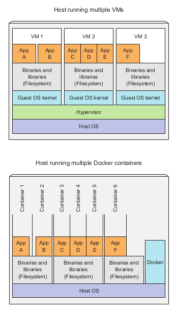
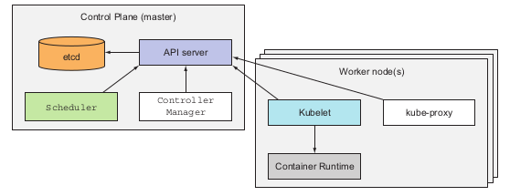

# Chapter 1. Introducing Kubernetes

- Kubernetes abstracts away the hardware infrastructure and exposes your whole data-center as a single enormous computational resource.

## Section 1.1. Understanding the need for a system like Kubernetes

- Moving from monolithic apps to microservices
  - Changing the style of development from one big process on one server to small components on different servers.
- The difference between monolithic and microservices is depicted in the following figure

  

- Microservices communicate syncronously or asyncronounsly.
- When a monolithic application can’t be scaled out because one of its parts is unscalable, splitting the app into microservices allows you to horizontally scale the parts that allow scaling out, and scale the parts that don’t, vertically instead of horizontally.

  

- Deploying dynamically linked applications that require different versions of shared libraries, and/or require other environment specifics, can quickly become a nightmare for the ops team who deploys and manages them on production servers.

  

- Providing a consistent environment to applications.
- Moving to continuous delivery: DevOps and NoOps.

## Section 1.2. Introducing container technologies

- Containers are more lightweight than VMs.
- VMs hypervisor have two types:
  - Type 1 hypervisor
  - Type 2 hypervisor
- The main benefit of virtual machine is the full isolation they provide, because each VM runs its own Linux Kernel.
- Processes isolation is achieved by two mechanisms:
  - Linux namespaces: each process sees its own personal view of the system (files, processes, network interfaces, hostname)
  - Linux Control Groups (cgroups): limit the amount of resources the process can consume (CPU, Memory, network bandwidth)
- Docker is a platform for packaging, distributing, and running applications.
- A big difference between Docker-based container images and VM
images is that container images are composed of layers, which can be shared and reused across multiple images.
- Docker has 3 main concepts that define its work:
  - Images: a package for the application and its environment.
  - Registries: is a repository that stores Docker images and facilitates easy sharing of those images between different people and computers.
  - Containers: is a regular Linux container created from a Docker-based container image.
- If a containerized application requires a specific kernel version, it may not work on every machine.
- We cannot containerize an application built for x86 architecture and expect it to run on an ARM-based machine because it also runs Docker.
- The following figure shows the difference between VMs and Containers

  

## Section 1.3. Introducing Kubernetes

- Kubernetes is built by Google based on the experience gained through Borg, Omega, and other internal Google systems.
- Kubernetes is a software system that allows you to easily deploy and manage containerized applications on top of it.
- Kubernetes enables you to run your software applications on thousands of computer nodes as if all nodes were a single, enormous computer.
- Kubernetes helps developers focus on the code app features instead of implementing infrastructure-related services like: service discovery, load-balancing, self-healing, and leader election.
- Kubernetes helps operations teams achieve better resource utilization using automatic scheduling.
- The following figure shows the components of Kubernetes

  

- At the hardware level, a Kubernetes cluster is composed of many nodes, which can be split into two types:
  - The master node, which hosts the Kubernetes Control Plane that controls and manages the whole Kubernetes system.
  - Worker nodes that run the actual applications you deploy.
- Control Plane components can run on a single node or distributed on multiple nodes to ensure high availability.
- Control Plane components are:
  - The Kubernetes API Server: facilitate communication between components.
  - The Scheduler: assigns a worker node to each deployable component of the application.
  - The Controller Manager: performs cluster-level functions, such as replicating components, keeping track of worker nodes, handling node failures.
  - etcd: a reliable distributed data store that persistently stores the cluster configuration.
- The worker nodes components that are responsible of running, monitoring, and providing services are:
  - Docker, rkt, or another container runtime, which runs your containers.
  - The Kubelet, which talks to the API server and manages containers on its node.
  - The Kubernetes Service Proxy (kube-proxy), which load-balances network traffic between application components.
- The following are some benefits of using Kubernetes:
  - Simplifying application deployment
  - Achieving better hardware utilization
  - Health checking and self-healing
  - Automatic scaling
  - Simplifying application development
