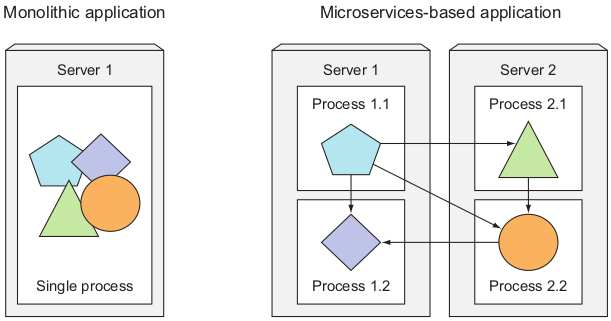
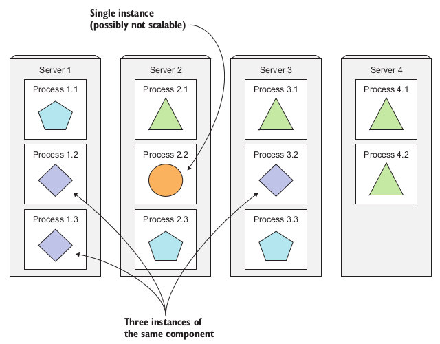
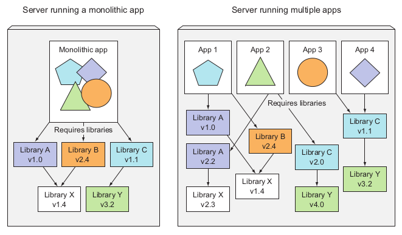

# Chapter 1. Introducing Kubernetes
- Kubernetes abstracts away the hardware infrastructure and exposes your whole data-center as a single enormous computational resource.
## Section 1.1. Understanding the need for a system like Kubernetes
- Moving from monolithic apps to microservices
  - Changing the style of development from one big process on one server to small components on different servers.
- The difference between monolithic and microservices is depicted in the following figure

  

- Microservices communicate syncronously or asyncronounsly.
- When a monolithic application can’t be scaled out because one of its parts is unscalable, splitting the app into microservices allows you to horizontally scale the parts that allow scaling out, and scale the parts that don’t, vertically instead of horizontally.

  

- Deploying dynamically linked applications that require different versions of shared libraries, and/or require other environment specifics, can quickly become a nightmare for the ops team who deploys and manages them on production servers.

  

- Providing a consistent environment to applications.
- Moving to continuous delivery: DevOps and NoOps.
## Section 1.2. Introducing container technologies
## Section 1.3. Introducing Kubernetes